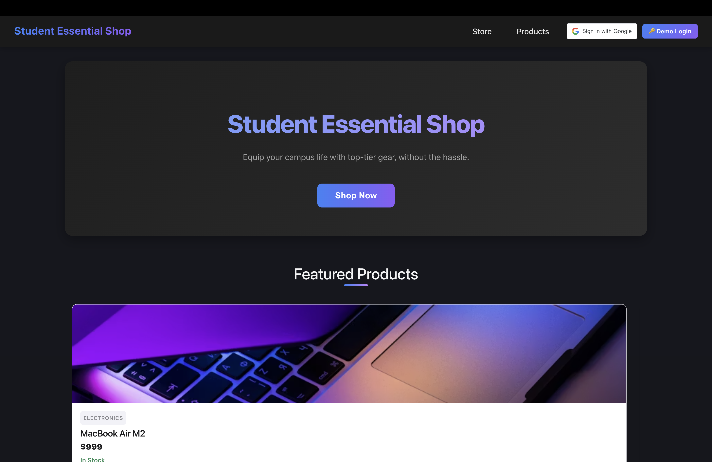
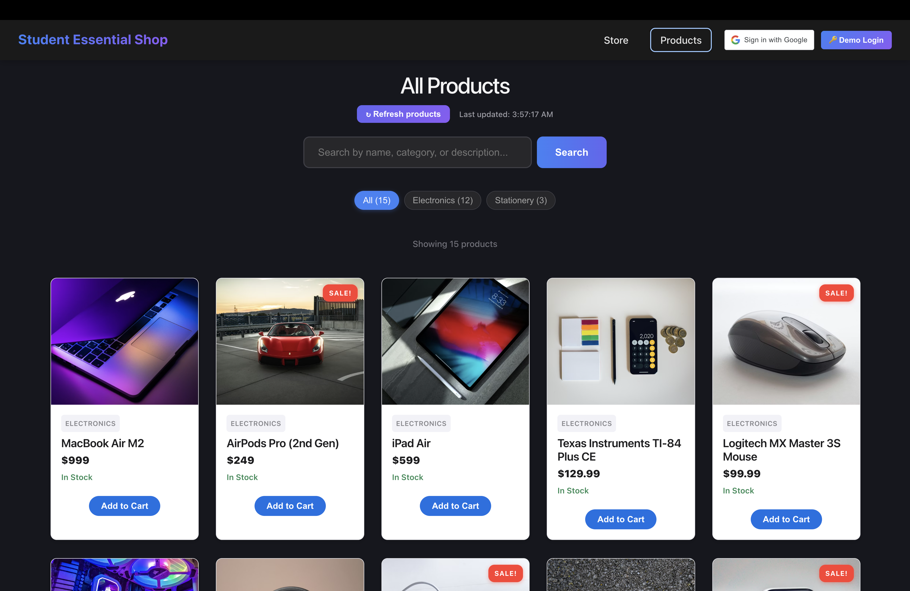

# Student Essential Shop

For the final project of COS108, I have build an e-commerce application for students with AI tools. Using the flask framework as the backend and React as the frontend, this application allows students to purchase essential items with ease. The application includes a Store/Home page, a Product page, a Cart page, a Checkout page, a Orders page, a Admin inventory page, and hidden other pages. The app support google login and support three roles for users: customer, cashier and admin. Customer can use the customer frontend page to purchase items. Cashier can use the POS page to process orders. Admin can use the admin backend page to update the price and stock of the products, add or remove products, manage discounts and view all the orders. The application is uploaded and can be visited online

## Features

- **Student Interface:** browse products, manage cart, place orders, and track order history.
- **Admin Dashboard:** manage inventory, track orders, manage discounts, and generate receipts.
- **Point of Sale (POS):** fast transaction interface for cashiers to process orders.
- **Authentication:** Google OAuth with secure JWT-based session management.
- **Role-Based Access:** granular permissions for customers, cashiers, and admins.
- **Responsive Design:** modern, mobile-friendly user experience.
- **Persistence-Aware Cart:** cart data persists across sessions and device changes.

## 🚀 Live Links
- **Frontend:** [https://student-essential-shop.vercel.app](https://student-essential-shop.vercel.app)
- **Backend:** [https://yuhe.pythonanywhere.com](https://yuhe.pythonanywhere.com)

## 🔑 Demo Access (For Testing)
Want to test the app without a Google account? Use the **Demo Login** button on the site:

| Field | Value |
|-------|-------|
| **Demo Code** | `ADMIN_DEMO_2026` |

After clicking "🔑 Demo Login", enter the code above and select a role:
- **Admin** — full access to inventory, orders, discounts, and POS
- **Cashier** — POS terminal access
- **Customer** — browse, add to cart, and place orders

## 💻 Local Setup
Run these commands to start the full stack:
1. **Setup Backend:** `cd backend && pip install -r requirements.txt && python app.py`
2. **Setup Frontend:** `cd frontend/my-app && npm install && npm run dev`
3. **Visit App:** Open [http://localhost:5173](http://localhost:5173) in your browser.

*(Note: Ensure you have your `.env` files configured in both directories based on the provided `.env.example` files.)*
